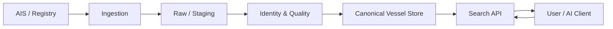
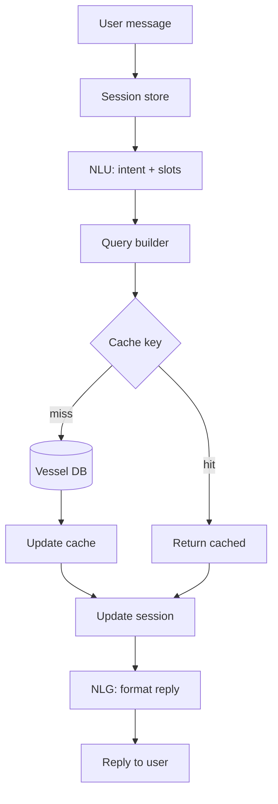
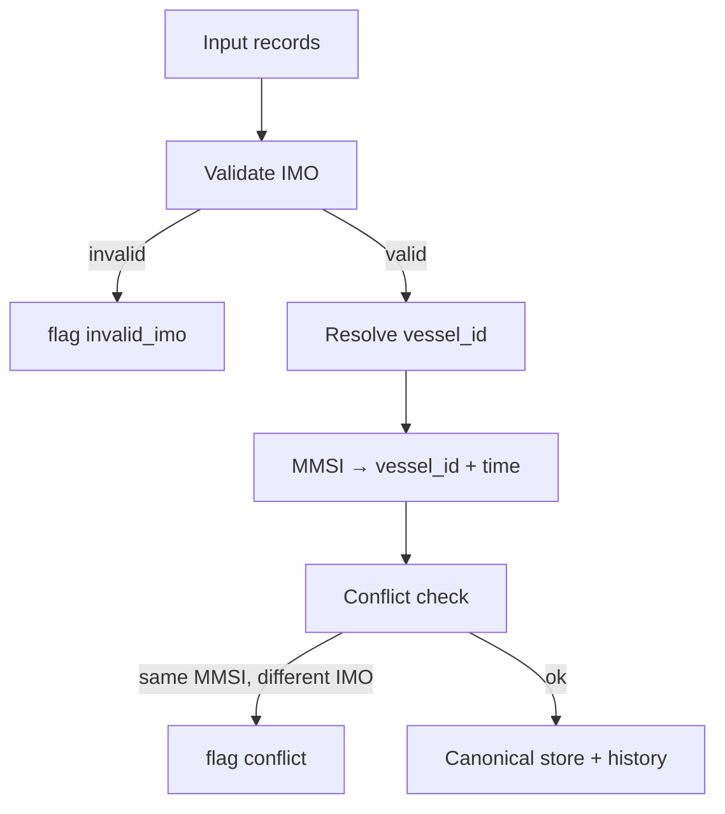

# System architecture (Mermaid)

**Rationale:** The flow keeps raw data separate from the canonical vessel store so we can replay ingestion and reprocess after rule changes. Identity & Quality sits between raw and canonical so we never write invalid or unresolved identities into the master tables. Search (and any AI layer) talks only to the canonical store so results are consistent.

**Trade-offs:** Adding a dedicated Identity & Quality step increases latency and complexity compared to writing directly from ingestion; we accept that for data quality. Cache (in the conversational flow) is optional for the minimal case study; in production it reduces DB load and latency for repeated queries.

## High-level data and search flow

## Conversational AI and cache flow

## Identity resolution pipeline

